<div align="center">



<br><br>


<br><br>


<br>


</div>

---

## `$ whoami`

```bash
root@blueteam:~# whoami --verbose

NAME        : Al-Amin Mahmud
ROLE        : Blue Team / SOC Analyst · CSE Undergraduate
LOCATION    : Chittagong, Bangladesh
EDUCATION   : B.Sc in CSE, BGC Trust University (5th Semester, Sec. B)
GOAL        : MS in Cybersecurity, Germany
MISSION     : Detect early, respond fast, and build defenses that hold
              under real adversarial pressure — not just in a lab.
STATUS      : Learning . Building . Defending
```

> Focused on the defensive side of security — log analysis, detection
> engineering, and incident response — backed by a systems programming
> foundation in Python, C, and SQL.

---

## `$ nmap -sV --scripts=skills localhost`

```bash
Starting Nmap scan on SKILLSET...
Host is up (0.001s latency).

PORT      STATE   SERVICE              VERSION
----      -----   -------              -------
22/tcp    open    languages            Python, C, SQL
443/tcp   open    security-domains     Network Security, Cryptography, DFIR
514/tcp   open    soc-ops              SIEM, EDR, Log Analysis, Threat Detection
1337/tcp  open    certifications       OPSWAT ICIP, ISC2 CC (in progress)

Nmap done: 1 host scanned — 4 open ports — 0 vulnerabilities found.
```

---

## `$ ls -la ~/projects/`

```bash
root@blueteam:~/projects# ls -la

drwxr-xr-x  gym-management-system/       # University assignment
drwxr-xr-x  school-management-system/    # Academic project
drwxr-xr-x  security-scripts/            # Cybersecurity mini-projects
```

<table>
<tr><td>

**⌘ GYM-MANAGEMENT-SYSTEM**
```
Type        : University assignment
Function    : Manages member records, memberships, and scheduling
              for a gym through a structured application workflow
Repo        : github.com/alaminmahmud202/gym-management-system
```

</td></tr>
<tr><td>

**⌘ SCHOOL-MANAGEMENT-SYSTEM**
```
Type        : Academic project
Function    : Handles student records, attendance, and administrative
              operations for a school environment
Repo        : github.com/alaminmahmud202/school-management-system
```

</td></tr>
<tr><td>

**⌘ SECURITY-SCRIPTS**
```
Type        : Cybersecurity mini-projects
Function    : A collection of smaller scripts and labs covering
              network security, scanning, and defensive tooling
Repo        : github.com/alaminmahmud202/security-scripts
```

</td></tr>
</table>

> Update the repo links above once each project is pushed to GitHub.

---

## `$ cat certifications.txt`

```bash
root@blueteam:~# cat certifications.txt

[OPSWAT]   ICIP — Industrial Cybersecurity Interoperability Program
[ISC2]     Certified in Cybersecurity (CC) — in progress

[STATUS] Pipeline active. Next cert queued.
```

---

## `$ history | grep experience`

```bash
root@blueteam:~# history | grep -A3 "experience"

> No prior internship on record.
  Status : Actively seeking SOC / Blue Team / Cybersecurity
           internship opportunities.
```

---

## `$ tail -f github_activity.log`

<div align="center">


</div>

---

## `$ curl -X POST /contact --data "reason=collaboration"`

```bash
root@blueteam:~# curl -X POST https://contact.me --data "reason=collaboration"

> 200 OK — Connection established.
```

<div align="center">

[](mailto:alaminmahmud684@gmail.com)
[](https://www.linkedin.com/in/alaminmahmud202/)
[](https://github.com/alaminmahmud202)

</div>

---

<div align="center">

```
root@blueteam:~# exit
Connection to portfolio closed.
```


</div>
